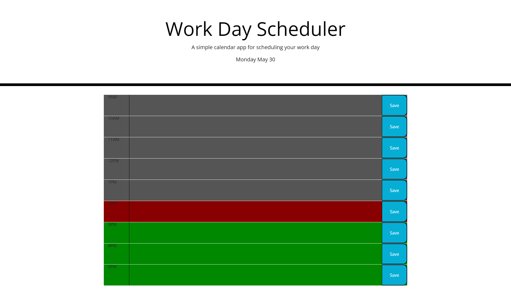

# Weekday-Scheduler

## Table of Contents
- [Description](#description)
- [Visuals](#visuals)
- [Resources](#resources)

## Description
- Added local storage to the page to allow the user to keep info on refresh
- Created timeblocks with html and bootstrap
- Color coded each timeblock depending on the hour of day
- Display the current day of the week, month, and day of the month
- Changed color of text area to allow the user to read it more easily
- Added hover effect on the "save" button

## Visuals

## Resources 
[Live site](https://ntraugh.github.io/Weekday-Scheduler/)

[Repository](https://github.com/ntraugh/Weekday-Scheduler)
